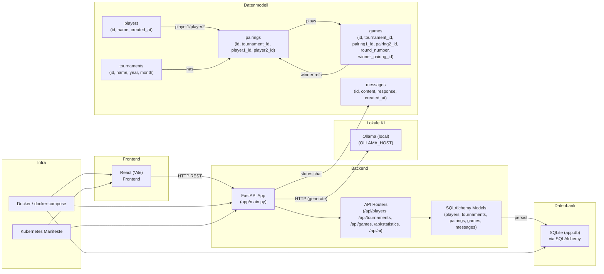

# ai-app — Mermaid Architekturdiagramm

Die folgende Datei enthält ein Mermaid-Diagramm der Architektur. Du kannst es z.B. in einer Markdown-Datei oder im VS Code Mermaid-Preview anzeigen.

Hinweis: Kopiere den Mermaid-Block in eine Markdown-Datei oder öffne `ARCHITECTURE_MERMAID.md` mit einer Mermaid-Preview-Extension in VS Code, um das Diagramm visuell darzustellen.
